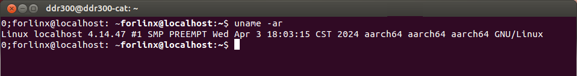
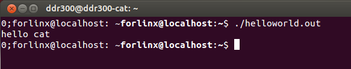
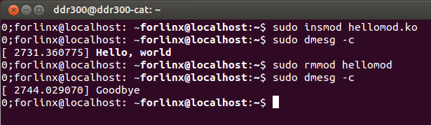

# For BSP test

## Rasp 3B  CM4
Linux 5.10.103  
2022-04-04-raspios-buster-armhf.img   

Preparing environment:  

sudo apt update  
sudo apt-get -y install raspberrypi-kernel-headers  

sudo insmod hellomod.ko  
dmesg | tail  

sudo rmmod hellomod  
dmesg | tail

## ubuntu
### hellomod  
Piror action: 
sudo apt-get install linux-headers-$(uname -r) 

## OK1012A / LS1012

ubuntu 18.04.1 K4.14.47  
  
### hello world
compiler at 
/usr/bin/aarch64-linux-gnu-gcc 
  
### hellomod
KERNELDIR at 
/home/forlinx/work/OK10xx-linux-fs/flexbuild/build/linux/linux/arm64/output  
  
